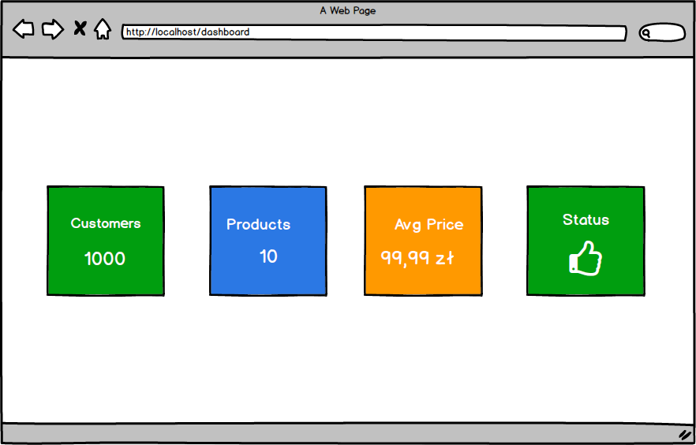

# Exercise: Creating Custom Components Using a Dashboard Example

## Goal:
Your task is to create a simple Blazor component that can be reused multiple times on a dashboard-like page. The component should display specific information about a product, user, or other resources depending on the parameters passed.

## Mockup: 
  

## Functional requirements:

### 1. Component:
- Create a custom Blazor component (e.g., `InfoCard.razor`).
- The component should accept the following parameters:
  - Title (string)
  - Value (string or number)
  - BackgroundColor (optional – a string with a CSS class)
  - (Optional) Icon – e.g., in the form of an emoji or icon name

- The component should display the passed data in an aesthetically pleasing "box" (e.g., with shadow, rounded corners, etc.)

### 2. Dashboard:
- On the `Dashboard.razor` page, embed this component at least 4 times, each with different data.
- Example uses of the component:
  - Number of customers
  - Number of products
  - Average product price
  - System status (Online, Warning, Offline)
  

### 3. Appearance:
- The component should be ready for reuse in a grid layout (grid/flexbox).
- Styling can be done using CSS.

**Hint:** You can use https://flexboxlabs.netlify.app/ to design the layout